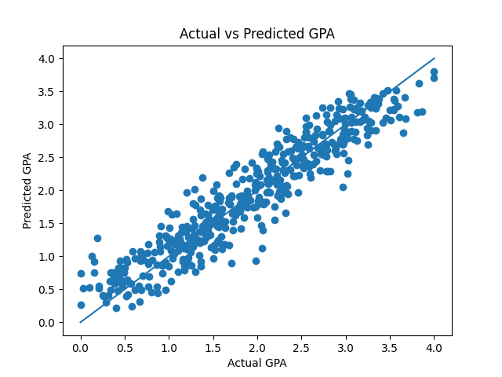

# 🎓 Student Performance Predictor

## 📌 Overview
This project predicts student GPA using machine learning based on factors like study time, absences, and tutoring.

## 🚀 Features
- Data preprocessing
- Exploratory Data Analysis (EDA)
- Linear Regression model
- Prediction system

## 🛠️ Tech Stack
- Python
- Pandas
- NumPy
- Matplotlib
- Scikit-learn

## 📊 Results
- R² Score: 0.88
- MSE: 0.095
- Strong correlation between actual and predicted GPA

## 📈 Output


## ▶️ How to Run
```bash
pip install pandas numpy matplotlib scikit-learn
python main.py
